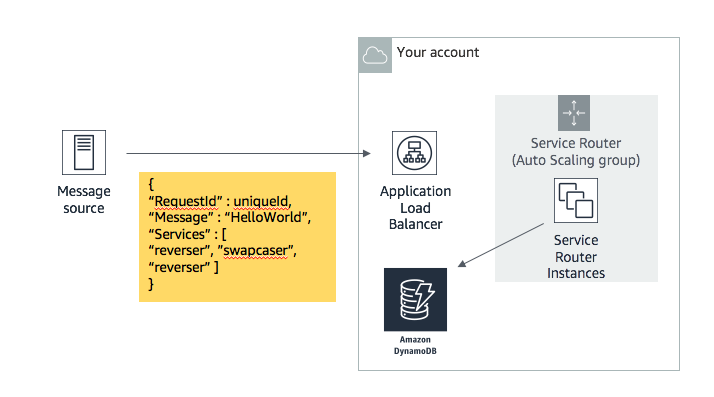
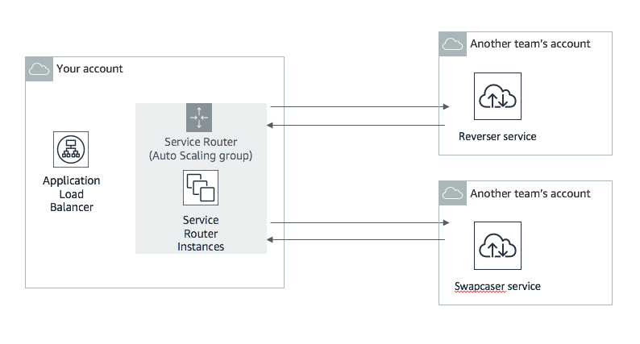
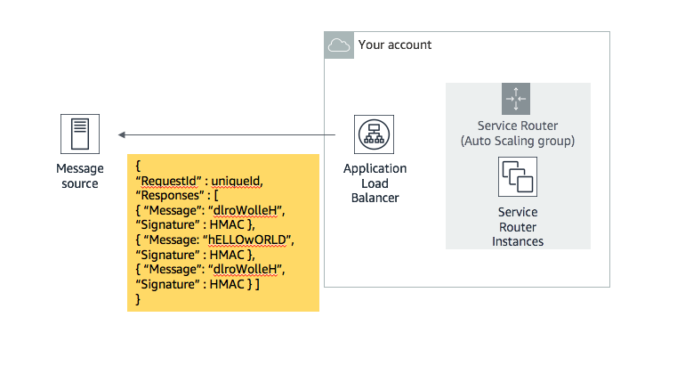
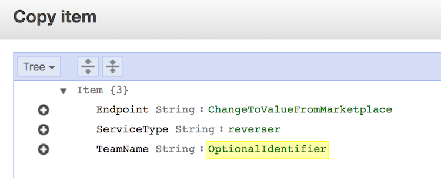

# Welcome to Unicorn Rentals!

### Background:

For our next-generation application, we are taking a “Microservices Mesh” approach.  
Every team has a copy of the frontend API (called the "Service Router"). The Service Router uses microservices from other internal teams.

Your team is running one of the many test-in-production Service Routers. It receives requests containing a data string, and a list of operations to be completed before it responds.  
The Service Router forwards the data string to the required microservice for each operation.  
The Service Router will find these microservice endpoints by looking in a DynamoDB table called “service-table”.  

### High-Level Game Plan:

* Deploy, Maintain and Optimize microservices for other teams to use. 
* Publish your services using the Dashboard inputs. This publishes your microservice on the "Services Marketplace"  
* Make your Service Router highly available. It comes attached to an Application Load Balancer and Autoscaling group which could be configured for HA.  
* Use the best microservices yourself (put them in your Dynamo table). Discover them via the Services Marketplace link in the dashboard.
* Don't consume your own services!  
* Keep everything going (use X-Ray, CW Metrics, CW Logs). Watch your [score events](https://dashboard.eventengine.run/score-events) for changes.  

### The Microservices: 

To maximise your score, you need to run copies of the microservices.  
When another teams Service Router receives a request, they may use your microservice to perform some of the required operations. If so, you get a share of their score.  

| Service Name  |Type       | Instructions                                           |
| ------------- |-----------| ------------------------------------------------------ |
| swapcaser     |SAM(Lambda and API Gateway) | [__Service and Instructions__](https://s3.amazonaws.com/ee-assets-prod-us-east-1/modules/gd2018/assets/swapcaser.zip)    |
| reverser      |Fargate    | [__Instructions__](https://s3.amazonaws.com/ee-assets-prod-us-east-1/modules/gd2018/assets/reverser-readme.txt)          |
| leeter        |Elastic Beanstalk | [__Service and Instructions__](https://s3.amazonaws.com/ee-assets-prod-us-east-1/modules/gd2018/assets/leeter.zip)       | 


__How do I know if my Microservice is working?__  
First, try using the `testsvc` program provided [in this zip file](https://s3.amazonaws.com/ee-assets-prod-us-east-1/modules/gd2018/assets/testsvc.zip). This will test the correctness of your microservice and provide some information about what is wrong if it is not working properly. `testsvc` is also useful to test other team's microservices. There is a README with usage information in the zip file.

Next, add the service's endpoint/URL into the correct input in the Dashboard. The Service Market place will report its health.  If you see latency and success rate of 0, but other team's services have values, you should re-check your microservice.   

__How to simulate a real request to my Microservice?__  
You can simulate a real user by using the `testsvc` program provided [in this zip file](https://s3.amazonaws.com/ee-assets-prod-us-east-1/modules/gd2018/assets/testsvc.zip).  
You could also use cURL, Httpie or Postman, etc. For example:
```
curl -d '{"Message":"TestMessage"}' -H 'Content-Type: application/json' URI
#Or with HTTPie
http POST URI Message='TestMessage'
```


### The Service Router:
__Your Services Router__   


__The Services Router looks up which microservice to send messages to, using the DynamoDB “service-table" table__   
Edit the DynamoDB table to update the microservices your Service Router uses. You want to use many services, but also only the fastest ones. If you use slower services, you get less score. The Legacy Services provided at the start of the game are very slow.  

__The Services Router then calls the relevant microservice endpoint in another DevOps team's account:__   


__Once it has received the responses from the other team(s), the Service Router returns the correct payload to the sender__   
The messages contain signatures from other teams, proving they did some work. Your team scores points, and so do the other teams who did some work for you.  


__How does the Service Router know where where to send messages (aka Service Discovery)?__  
Your account comes with a “service-table" DynamoDB table pre-made. Four Legacy Services are already listed in there.   However these were created by the last team (before they were fired), and are very slow.   

| DDB Field     | Description                                            | Required |
| ------------- | ------------------------------------------------------ |----------|
| Endpoint      | URI of a microservice our service-router can use       | Yes      |
| ServiceType   | Type of service (reverser, swapcaser, leeter)           | Yes      |
| TeamName      | A field to help recall which teams service it is       | No       |

You will need to add new services to this table, and remove the old slow ones.  
An easy way to do this, is duplicate an old entry, and change the Endpoint and TeamName fields.  


__Building Service Routers__  
Source is here:  
https://s3.amazonaws.com/ee-assets-prod-us-east-1/modules/gd2018/assets/service-router.zip

To build/rebuild your Service Router, use a userdata like below with Amazon Linux 2. Your account comes with an Autoscaling group already built this way.  
```
#!/bin/bash
export AWS_DEFAULT_REGION=<region_the_game_is_running_in>
aws configure set region $AWS_DEFAULT_REGION
cd /home/ec2-user/
yum install -y unzip python-pip
curl -o xray.zip https://s3.amazonaws.com/aws-xray-assets.us-east-1/xray-daemon/aws-xray-daemon-linux-2.x.zip
#for ARM / a1 instances, use 'curl -o xray.zip https://s3.amazonaws.com/ee-assets-prod-us-east-1/modules/gd2018/assets/xray-arm.zip'
unzip xray.zip
chmod +x ./xray && nohup ./xray &
curl -o service-router.zip https://s3.amazonaws.com/EEASSETBUCKET/modules/gd2018/assets/service-router.zip
unzip service-router.zip
cd service-router
pip install -r requirements.txt
python service-router.py
```
Learn about how userdata works here: https://docs.aws.amazon.com/AWSEC2/latest/UserGuide/user-data.html  
You can also login to the instance using Session Manager:  https://console.aws.amazon.com/systems-manager/session-manager/  

__Size Restrictions__
The Service Router doesn't need to be big: a1.medium or t2 or t3 nano/micro/small


### Operations FAQ:

__How do I know if my Service Router is working?__  
Test its endpoint in a browser. You should see the "service map" - a list of the services it has pulled from the DynamoDB table. For example:

Service Map: {'reverser': ['http://reverser-url'], 'givemeasign': ['http://givemeasign-url'], 'swapcaser': ['http://swapcaser-url']}

__How do I know what my Service Router is doing?__  
The Service Router is integrated with AWS X-Ray and Amazon CloudWatch Logs. If the instance/container/lambda has the 'PlayerInstanceProfile' or 'TEAMROLE' IAM role attached, it will send metrics and logs to those services.  
Cloudwatch Insights can be used to search the Service Routers logs for errors e.g:  
```
fields @timestamp, status, message
| filter status not like /info/
| sort @timestamp desc
| limit 20
```

__How do I run/test Service Router interactively?__   
Use Session Manager (part of Systems Manager) to create a session to your instance. You will need to update the instances SSM Agent to do this. Follow the instructions in Session Manager console.  
```
sudo su ec2-user
cd /home/ec2-user/
cd service-router/
sudo python service-router.py 
```  
You may also want to get/start xray, to get request traces.  
```
curl -O https://s3.amazonaws.com/aws-xray-assets.us-east-1/xray-daemon/aws-xray-daemon-linux-2.x.zip
unzip aws-xray-daemon-linux-2.x.zip
nohup ./xray &
```

__How to simulate a real request to my Service Router?__  
You can simulate a real user by using cURL, Httpie or Postman (GUI API testing tool).  
```
#curl https://curl.haxx.se/download.html: 
curl -d '{"Message":"TestMessage","RequestId":"test","Services":["reverser","swapcaser"]}' -H 'Content-Type: application/json' URI
#curl (Windows escaping)
curl -d "{\"Message\":\"TestMessage\",\"RequestId\":\"test\",\"Services\":[\"reverser\",\"swapcaser\"]}" -H "Content-Type: application/json" URI
#Httpie https://httpie.org/
http POST URI Message='TestMessage' RequestId='test' Services:='["reverser","swapcaser"]'
```
